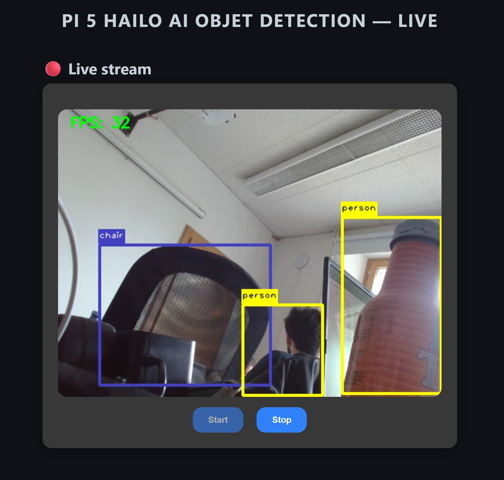

## Raspberry Pi 5 with Hailo AI and FastAPI

This project uses a Raspberry Pi 5 equipped with a Hailo AI accelerator to perform real-time object detection on video streams and broadcast the annotated output to a web page via FastAPI.

**Screenshot of the web app**


**Screenshot of the web app displaying live object detection results.**

---

### Repository Structure

* **Server code**: FastAPI application and WebSocket handlers
* **Pre-trained AI model**: YOLO model weights
* **Web interface**: HTML/CSS templates and static assets
* **Utility scripts**:

  * Training the YOLO model
  * Compiling the model for the Hailo accelerator

**Train the model (Colab notebook):**
[Yolo Train](https://colab.research.google.com/drive/1kkYMit4gj5RQPTyDT4U0StDJmXVad0Oz?usp=sharing)

**Compile for Hailo (Colab notebook):**
[Compile Hailo Model](https://colab.research.google.com/drive/1cI-a5BHdVLQiYJJdzprg2WqeuU2pA_YQ?usp=drive_link)

---

### Prerequisites

* **DeGirum PySDK**: Install the [DeGirum PySDK](https://github.com/DeGirum/hailo_examples/blob/main/README.md) to manage loading and inference of the Hailo model in Python.

---

### Setup

1. **Clone the repository**

   ```bash
   git clone https://github.com/PiWebswiss/raspberry_PI5_hailo-web-app.git
   cd hailo_examples
   ```

2. **Create and activate a virtual environment**

   ```bash
   python3 -m venv degirum_env
   source degirum_env/bin/activate
   ```

3. **Install dependencies**

   ```bash
   pip install -r requirements.txt
   ```

4. **Register the virtual environment in Jupyter (optional)**

   ```bash
   python -m ipykernel install --user --name=degirum_env --display-name "Python (degirum_env)"
   ```

5. **Install FastAPI and Uvicorn**

   ```bash
   pip install fastapi uvicorn
   ```

---

### Running the Server

1. **Activate the virtual environment**

   ```bash
   source degirum_env/bin/activate
   ```

2. **Start the FastAPI server**

   ```bash
   uvicorn main:app --host 0.0.0.0 --port 8000
   ```

3. **View the stream**
   Open your browser to `http://127.0.0.1:8000/` to see the AI-processed video.
